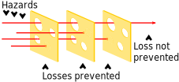
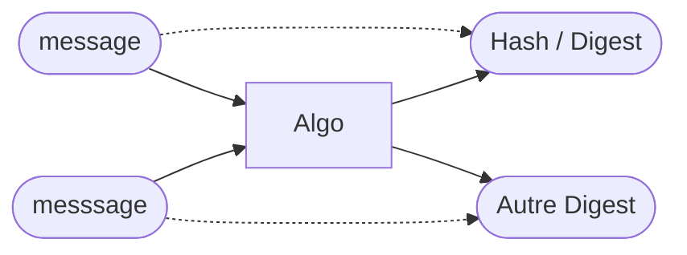
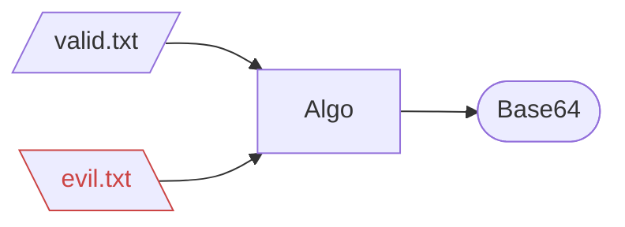
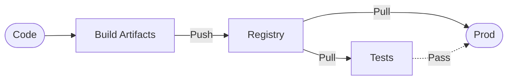
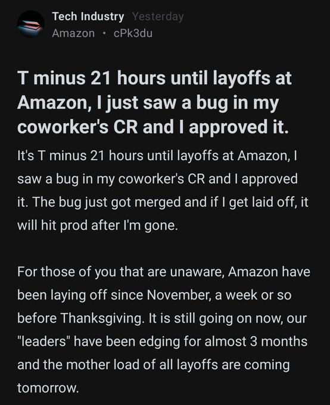
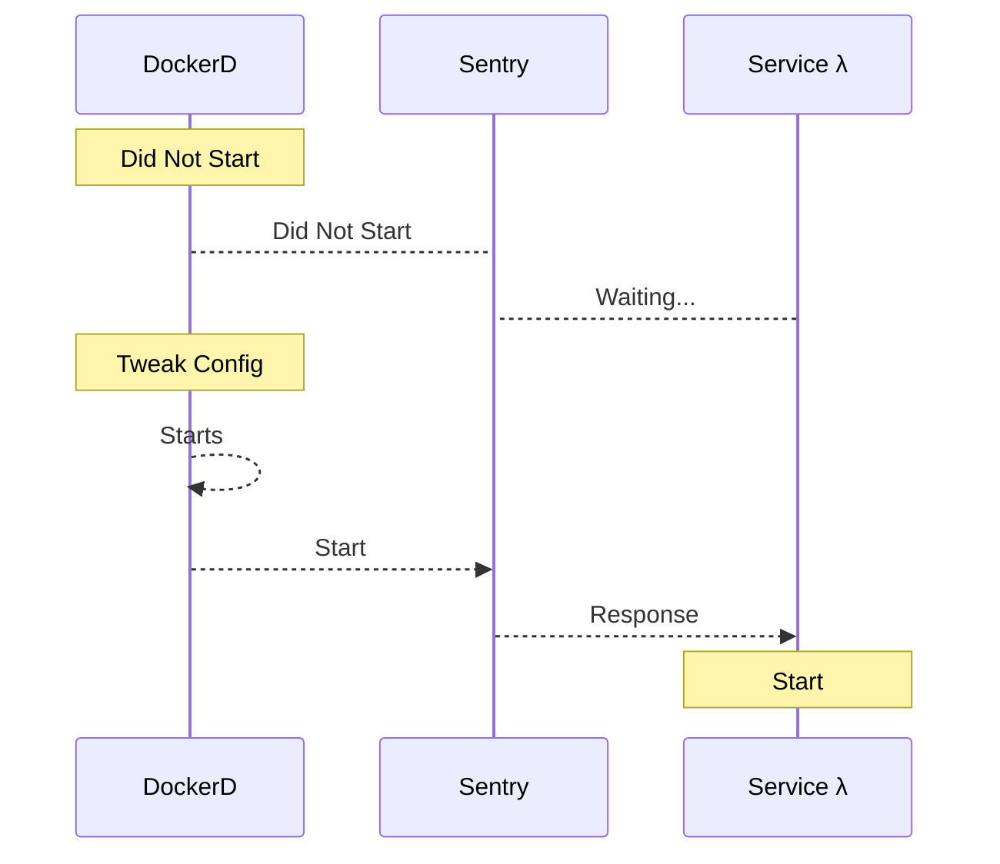
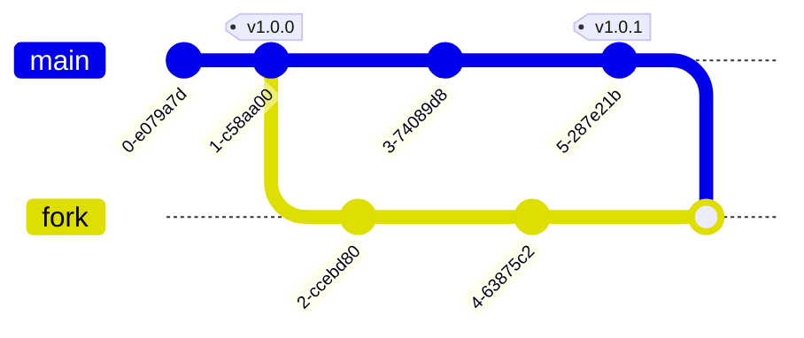
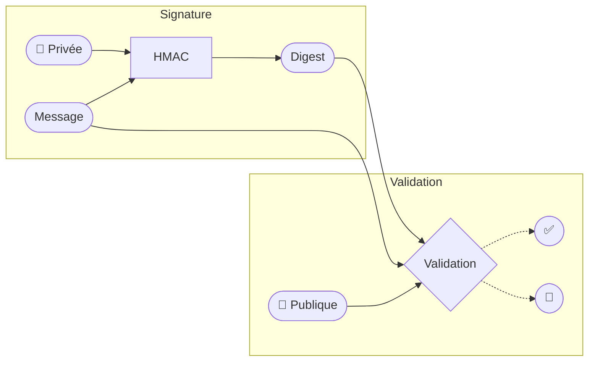
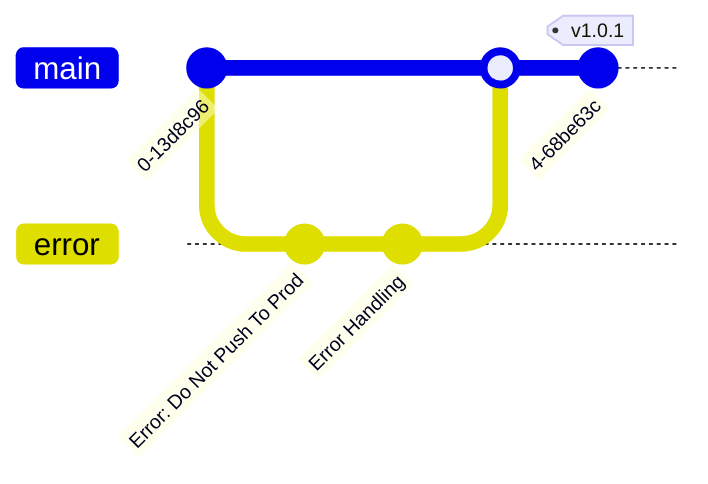
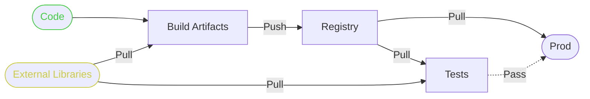

# Supply Chain Attacks

### Signer ici

---

> "Dance like nobody is watching.  
> Encrypt like everyone is."  
> 
> Neil R. Wiler (@grifter801)  
> Bart Stump (@theStump3r)  
> Black Hat 2015

---

# ToC

- $ whoami
- Desjardins
- Avertissements
- Supply-Chain Attacks
    - Intégrité
- Code-based Supply Chain Attacks
    - Authenticité
    - Non-Repudiation

---

<!-- .slide: data-background="imgs/color-wheel-768x676.png" -->
# $ whoami

---

<!---->


---

### Avertissement
- Les opinions exprimées dans la présente présentation sont celles de l'auteur.  
- Elles ne prétendent pas refléter les opinions ni n'engagnent d'aucune façon le mouvement Desjardins ou ses filiales

--


--

### Sécurité: YMMW


--

### Sécurité: Fromage Suisse



Par BenAveling - Oeuvre Propre, CC BY-SA 4.0, https://commons.wikimedia.org/w/index.php?curid=91881875

---

### Supply Chain Attacks


--

# Intégrité


source: https://www.labelsonline.co.uk/jar-seal-labels-sealed-for-freshness-se1087

--

### Hachage



--

### En Code

```typescript
import { createHash } from 'crypto'
createHash('sha256')
    .update('Lorem Ipsum')
    .digest()
    .toString('base64')
// 'Aw3B+TbDQVr/PzNXFjUVGQ00eijnWOH3F9F7rkU1Qck='
```

--

### package-lock.json

```json
{
  "lockfileVersion": 3,
  "packages": {
    "node_modules/@sambego/diorama": {
      "version": "1.1.4",
      "resolved": "https://registry.npmjs.org/@sambego/diorama/-/diorama-1.1.4.tgz",
      "integrity": "sha512-BvdUclMexhy+kw2k5ylFw/N1ioOtdviKMhxIWAURFSs9xP6SrLTUO/6jbDMBzyLl/pur+i9nVfwC7oy5F23PMQ==",
    },
  }
}
```

---

### Confiance?

Le hachage permet de garantir:
- L'exactitude d'une copie
- L'intégrité d'une information en transport
- L'exactitude d'un installateur

--

### Confiance?

Aucune garantie **à l'origine**:
- Intégrité de la source d'information
    - ex: Attaque sur le registre
- Validité de la source d'information
    - Interception/Substitution (ex: MitM)

---

### Collisions (MD5 & SHA1)



---

### Supply Chain Attack: Code



---

Non couvert: Menaces internes



---

`/salt/states/users/gfournier.sls`
```diff
gfournier:
+ user.absent:
- user.present:
-   uid: 4005
-   groups:
-     - wheel

```

--

> Les serveurs protestent la mise à pied de Gab!
>
> - Une ancienne collègue

--



--

### Root Cause

```diff
{
+  "data-root": "/mnt/docker"
-  "graph": "/mnt/docker"
}
```

--

### Améliorations Possibles

| Service       | Instrumenté | Alerte |
|---------------|-------------|--------|
| Services      |      ✅     |   ✅   |
| Sentry        |      🔌     |   🔌   |
| Docker Daemon |      ✅     |   🔌   |

--

<!-- .slide: data-visibility="hidden" -->
[Neta Downtime](imgs/Neta_158_en.png)
source: https://neta.mk/archive

---

# Demo

### Impersonation

---

### Git AuthN !== Commit Author/Commiter Validation



---

### Authenticité


https://www.lr-origine.com/qui-sommes-nous/

--



---

### En Code

```typescript 
import { createHmac } from 'crypto'
createHmac('sha256', 'Super Secret Key')
    .update('Lorem Ipsum')
    .digest()
    .toString('base64')
// 'f+Woz3ZWtok1VZqH3EjX0nPgWbBRYYyzz39zUJR8Zoc='
```

---

# Non-Répudiation


source: https://commons.wikimedia.org/wiki/File:Signature_Justin_Trudeau.svg

---

### Commit Signing

- GPG
- SSH
- X.509

Plus d'info: https://docs.github.com/en/authentication/managing-commit-signature-verification/telling-git-about-your-signing-key

---

#### Install GnuPG

Windows: https://www.gpg4win.org/download.html

Mac: `brew install gpg`

Linux: `$ sudo apt install gpg gpg-agent`
(Probablement déà préinstallé)

--

### Generate new GPG key

> $ gpg --full-generate-key

--

### List Keys

> $ gpg --list-secret-keys --keyid-format=LONG
```{data-trim data-line-numbers="1|2|3"}
sec   ed25519/69BD15E0783D13C1 2023-04-26 [SC] [expires: 2025-04-25]
      79AF64C47A0DF9E8BABFC3AF69BD15E0783D13C1
uid                 [ultimate] Test Key <test@test.test>
```

--

### Exporter la clé publique

> $ gpg --armor --export 69BD15E0783D13C1

```
-----BEGIN PGP PUBLIC KEY BLOCK-----
...
-----END PGP PUBLIC KEY BLOCK-----
```

--

### [Upload au service git](https://github.com/settings/keys)

--

### Git

```sh
git config --global user.signingkey 69BD15E0783D13C1
git config --global commit.gpgsign true
```

--

### VSCode

```json
{
    "git.enableCommitSigning": true
}
```

---

Demo!

--

> sudo docker run -it --rm debian bash

```
apt install gpg

```

---

# Push signing

Merci [MrIcon](https://people.kernel.org/monsieuricon/signed-git-pushes)

--

> Signing every commit is stupid.
> Only sign golden commits
>
> Linus Torvals ~2010 (reconstructed)

--

# [SHA1ttered](shattered.io)

--



--

### Push Signing: Activer Client-Side

```
git config --global push.signing if-asked
```

--

### Push Signing: Activer Server-Side

### git >= 2.2.0
`/etc/gitconfig`
```
[receive]
    advertisePushOptions = true
    certNonceSeed = "<uniquerandomstring>"
```

--

### Push Signing: Activer Server-Side

- *Gitea*: [Unofficial](https://github.com/go-gitea/gitea/issues/13454)
- *GitLab*: Feature Flag
- *GitHub*: [Requested](https://github.com/orgs/community/discussions/23515)

---



---

> "Dance like nobody is watching.  
> Encrypt like everyone is."  
> 
> Neil R. Wiler (@grifter801)  
> Bart Stump (@theStump3r)  
> Black Hat 2015

---

# Sources

Sauf expressément noté, la majorité des cartoons utilisés proviennent de:
- turnoff.us
- neta.mk/archive

---

# Questions?

# Commentaires?

# Insultes?

---

<!-- .slide:data-background="imgs/bonfire.gif" -->
## Bonne St-Jean! {class="r-fit-text"}

