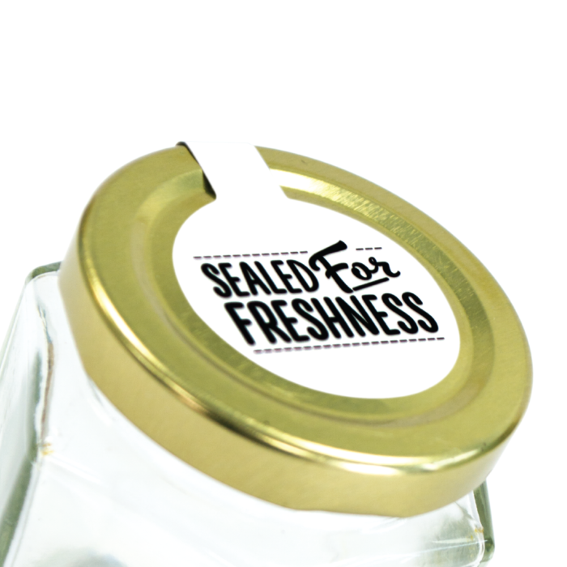
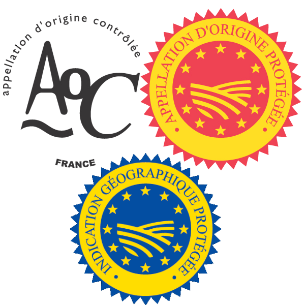

```mermaid
flowchart LR

subgraph Signature
    PK(["🔑 Privée"]) --> H
    M([Message]) --> H[HMAC] --> D([Digest])
end

subgraph Validation
    D --> V{Validation} -.-> O(["✅"])
    M & Pub(["🔑 Publique"]) --> V
    V -.-> N(["🚮"])
end
```

# Supply Chain Attacks

### Signer ici

---

# ToC

- $ whoami
- Desjardins
- Avertissements
- Supply-Chain Attacks
- Intégrité
- Authenticité

---

# $ whoami

--

# Desjardins


Corporate?
Local?

---

### Avertissement
> Les opinions exprimées dans la présente présentation sont celles de l'auteur.  
> Elles ne prétendent pas refléter les opinions ni n'engagnent d'aucune façon Desjardins


--

### Sécurité: YMMW


--

### Sécurité: Fromage Suisse


Par BenAveling - Own work, CC BY-SA 4.0, https://commons.wikimedia.org/w/index.php?curid=91881875

---

### Supply Chain Attacks


--

# Intégrité



source: https://www.labelsonline.co.uk/jar-seal-labels-sealed-for-freshness-se1087

--

### Hachage


--

### En Code

```typescript
import { createHash } from 'crypto'
createHash('sha256')
    .update('Lorem Ipsum')
    .digest()
    .toString('base64')
// 'Aw3B+TbDQVr/PzNXFjUVGQ00eijnWOH3F9F7rkU1Qck='
```

--

### package-lock.json

```json
{
  "lockfileVersion": 3,
  "packages": {
    "node_modules/@sambego/diorama": {
      "version": "1.1.4",
      "resolved": "https://registry.npmjs.org/@sambego/diorama/-/diorama-1.1.4.tgz",
      "integrity": "sha512-BvdUclMexhy+kw2k5ylFw/N1ioOtdviKMhxIWAURFSs9xP6SrLTUO/6jbDMBzyLl/pur+i9nVfwC7oy5F23PMQ==",
    },
  }
}
```

---

### Confiance?

Le hachage permet de garantir:
- L'intégrité d'une information en transport
- L'exactitude d'une copie

Aucune garantie à l'origine:
- Intégrité de la source d'information
    - ex: Attaque sur le registre
- Validité de la source d'information
    - Interception/Substitution (ex: MitM)

---

### Collisions (MD5 & SHA1)


---

### Supply Chain Attack: Code


---

Non couvert: Menaces internes


---

`/salt/states/users/gfournier.sls`
```diff
gfournier:
+ user.absent:
- user.present:
-   uid: 4005
-   groups:
-     - wheel

```

--

> Les serveurs protestent la mise à pied de Gab!
>
> - Une ancienne collègue

--

### Root Cause

```diff
{
+  "data-root": "/mnt/docker"
-  "graph": "/mnt/docker"
}
```

--

### Améliorations Possibles

| Service       | Instrumenté | Alerte |
|---------------|-------------|--------|
| Services      |      ✅     |   ✅   |
| Sentry        |      🔌     |   🔌   |
| Docker Daemon |      ✅     |   🔌   |

---

### Git AuthN !== Commit Author/Commiter Validation


---

### Authenticité



https://www.lr-origine.com/qui-sommes-nous/

--



---

### En Code

```typescript 
import { createHmac } from 'crypto'
createHmac('sha256', 'Super Secret Key')
    .update('Lorem Ipsum')
    .digest()
    .toString('base64')
// 'f+Woz3ZWtok1VZqH3EjX0nPgWbBRYYyzz39zUJR8Zoc='
```

---

# Non-Répudiation


source: https://commons.wikimedia.org/wiki/File:Signature_Justin_Trudeau.svg

---

# Commit Signing

## Install GnuPG

Windows: https://www.gpg4win.org/download.html

Mac: `brew install gpg`

Linux: `$ sudo apt install gpg gpg-agent`
(Probablement déà préinstallé)

--

##$ Generate new GPG key

> $ gpg --full-generate-key

--

### List Keys

> $ gpg --list-secret-keys --keyid-format=LONG
```{data-trim data-line-numbers="1|2|3"}
sec   ed25519/69BD15E0783D13C1 2023-04-26 [SC] [expires: 2025-04-25]
      79AF64C47A0DF9E8BABFC3AF69BD15E0783D13C1
uid                 [ultimate] Test Key <test@test.test>
```

--

### Exporter la clé publique

> $ gpg --armor --export 69BD15E0783D13C1

```
-----BEGIN PGP PUBLIC KEY BLOCK-----
...
-----END PGP PUBLIC KEY BLOCK-----
```

--

### Git

```sh
git config --global user.signingkey 69BD15E0783D13C1
git config --global commit.gpgsign true
```

--

### VSCode

```json
{
    "git.enableCommitSigning": true
}
```

---

Demo!

--

> sudo docker run -it --rm debian bash

```
apt install gpg

```

---

# Push signing

---